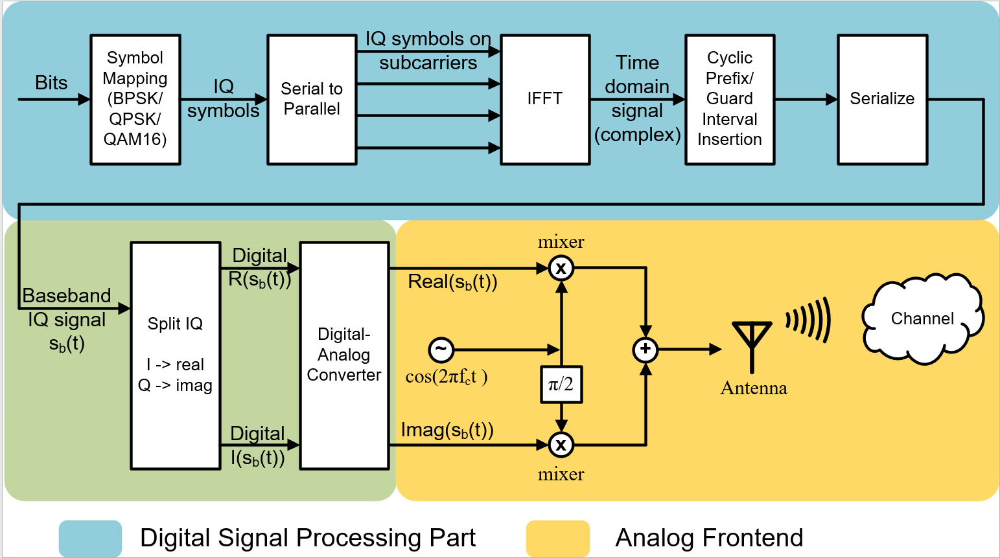
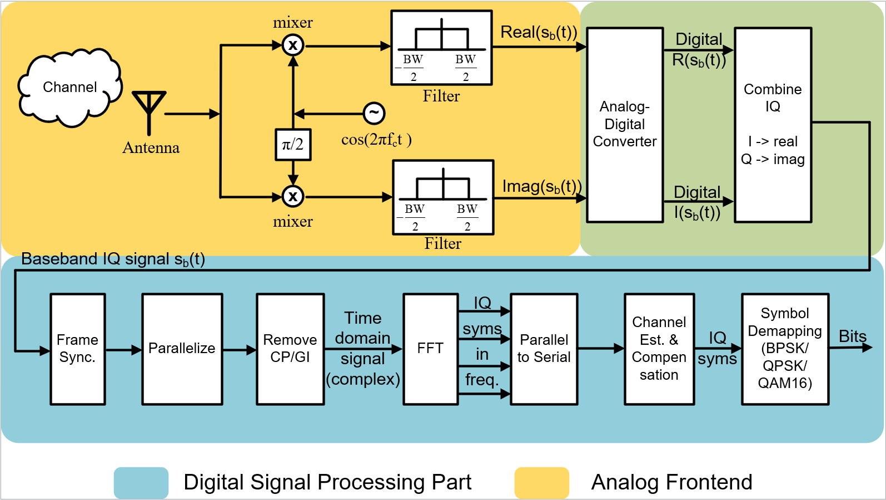
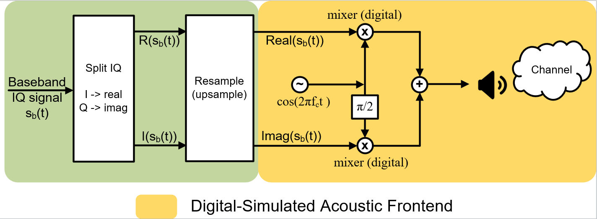
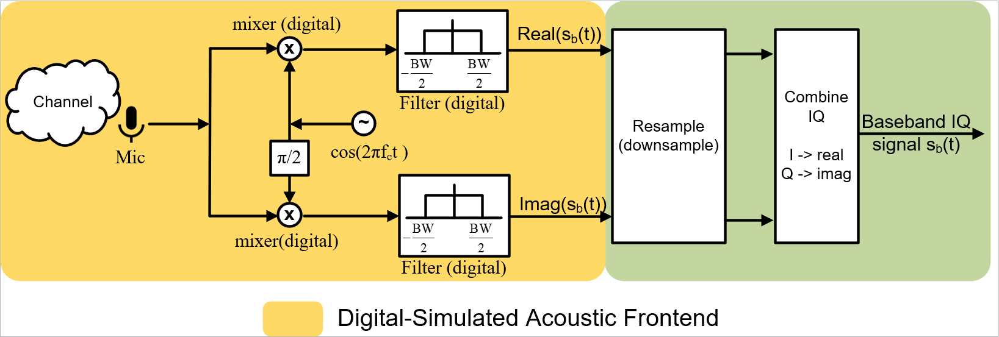
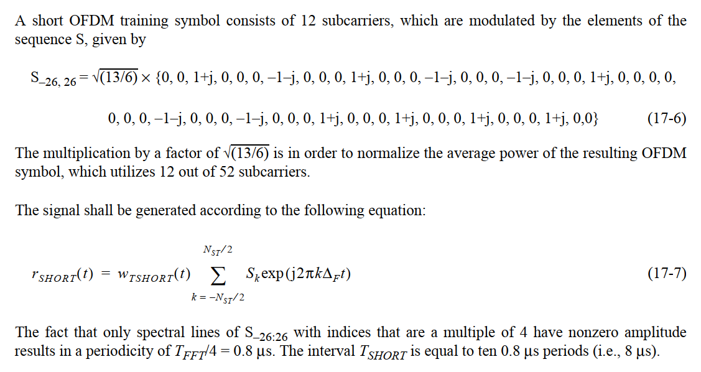
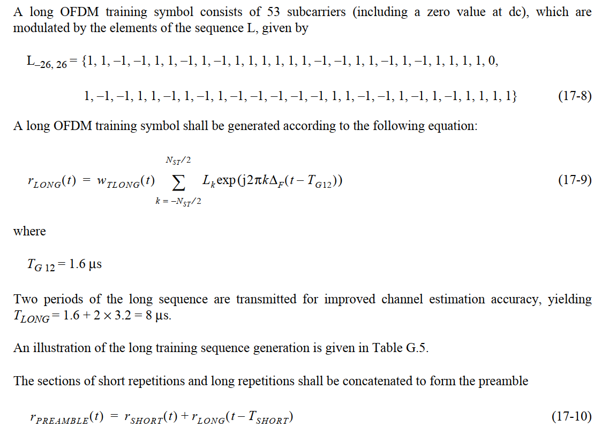
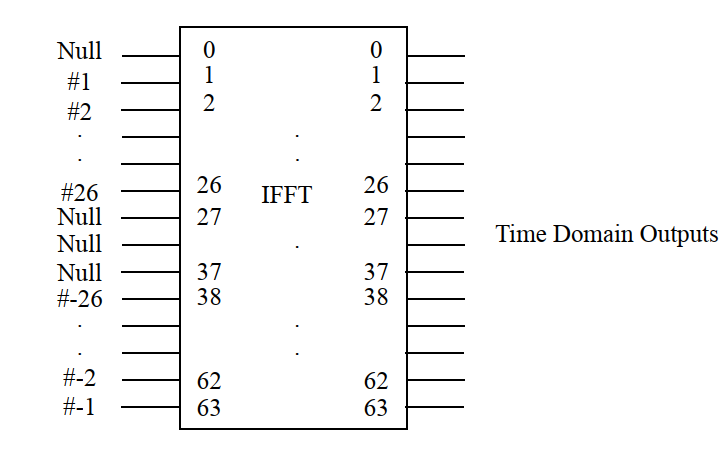
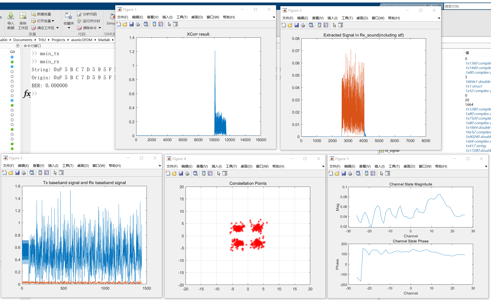

# acousticOFDM

### 1. Introduction
**acousticOFDM** is an simple acoustic implementation of OFDM-modulated communication. Two android phones are used to play and record the acoustic signal and transmit bits information. Current `main` branch is a refactor of the legacy implementation, which optimizes the main modulation part and adds IQ mod/demod in the transceiver. The legacy implementation has low spectrum efficiency and limits the throughput of OFDM transmission.

### 2. Branch and Folder Explanation
- `main` branch contains the new IQ-based implementation of **acousticOFDM**. Folder `Matlab` contains MATLAB implementation, where `main_tx.m` and `main_rx.m` are the entrances for sender signal generation and receiver signal processing, respectively. Folder `AudioTransceiver` contains the *Android Studio* project for audio signal transmitter and receiver. The program is only used to play the MATLAB-generated signal and record the received signal. It does not contain any modulation and demodulation implementation. Folder `Figures` contains some figures for this Readme.
- `legacy` branch contains the legacy implementation and maybe some archived functions. In this branch, folder `Matlab` also contains the MATLAB OFDM modulation and demodulation. Folder `asonicOFDM` is the legacy Android implementation of the whole transmitting and receiving process. Different from `main` branch, it contains the signal generation, modulation, and demodulation. However the implementation is pretty old and has limited throughput as discussed above.

### 3. Introduction of OFDM

OFDM (Orthogonal Frequency Division Multiplexing) uses multiple closely spaced orthogonal subcarrier signal to carry bits data in parallel. It is commonly used in today's RF transceivers. Detailed explanation of OFDM can be found easily and we will not go into the details here.

#### 3.1. OFDM in RF transceivers

In an RF transmitter, the whole process of OFDM is shown below:

The digital signal processing part is commonly seen in all types of OFDM modulators. It output the digital baseband IQ signal $s_b(t)$ which is centered in 0Hz and is a complex signal. This baseband signal is bound with a sampling frequency that is usually the bandwidth (BW) of  the signal. For common WiFi chips, the value is 20MHz (20Msps). Then, the signal goes through a DAC to be converted to analog form. The analog signal is went through an IQ modulation process which upconvert the signal to carrier frequency ($f_c$). Finally the signal is transmitted using an antenna. The analog frontend is implemented with analog/RF circuits and of course not achievable for acoustic scenario.

The OFDM receiver for RF is shown below:

As we can see, It almost simply inverts the modulation process for a transmitter. Differently, it contains the RF low pass filter to filter out the baseband signal and remove $2f_c$ part brought by the IQ demodulation. It also contains the frame synchronization and channel estimation part. Similarly, the analog frontend is implemented using RF circuits and usually unchangeable once made. The part we conduct signal processing is only the baseband signal, and in digital form.

#### 3.2. OFDM in acoustic system

For an acoustic implementation, it is easy to see that we can simply keep the digital processing part same with the RF implementation. In other words, the baseband processing is directly used. However, the main difference for RF and acoustic system is their frontends. RF transceivers use circuit to process the analog signal, e.g., mixers, filters, phase shifters. For acoustic systems, what we get is usually the sampled in-air signal in digital form. For example, a microphone samples the sound signal in 48000Hz and directly feeds the digital form samples to us. Therefore, to connect the baseband part of commonly seen OFDM modulators/demodulators with the acoustic frontend, we need to simulate the IQ modulation in digital form. In a transmitter, such a process is shown below:

We can see that there is not any DAC part. It is replaced by a resample part. The frontend part, however, has little difference. It merely simulates the process in RF transceivers. To understand why the resample part exists, we need some specific sampling configurations. For example, we let the sampling frequency for baseband signal be 4000Hz, the sampling frequency for sound wave be 48000Hz. To conduct the digital mixing process, we need to multiply the baseband with $\cos{(2\pi f_ct)}$. In digital implementation, this process require the two inputs to have the same sampling rate. Therefore, we need to upsample the baseband signal of 4000Hz to it of 48000Hz. In other words, we use the sound wave sampling frequency 48000Hz to simulate the analog processing part of RF transceivers.

Correspondingly, the process of an receiver is shown below:

It is very similar with Tx part, only the resample process is a downsampling now.

### 4. Design Details

We give some design details of **acousticOFDM**.

##### Packet Structure

The packet contains an STF (short training field), an LTF (long training field), and some data symbols. Each of the symbol lasts for 20ms, since the baseband sampling frequency is 4000Hz and every symbol is 80 points long. The packet structure is similar to WiFi OFDM packet but much simpler.

##### STF & LTF Definition

The STF is used for frame synchronization. It contains 5 periodic signal sequence which is the same for WiFi STF but in half length. The definition for WiFi STF is:

The LTF is used for the receiver to estimate the channel and compensate for data symbols. The definition is also the same with WiFi LTF but in half length. The definition for WiFi LTF is:

##### Subcarriers Allocation

We use 64 length FFT and 52 of which are used to transmit data, also the same with WiFi. The mapping between subcarrier numbers and its position in FFT is shown below:

##### Channel Estimation

We use the simplest Least Squares  (LS) channel estimation, which simply takes the result of the received signal on certain subcarrier dividing the transmitted signal. It can be improved using other method.

### 5. Results

We show the result of one reception here:

### Reference

[1] Molisch, Andreas F. Wireless communications. *John Wiley & Sons*, 2012.

[2] Tse, David, and Pramod Viswanath. Fundamentals of wireless communication. *Cambridge university press*, 2005.

[3] "IEEE Standard for Information Technology - Telecommunications and Information Exchange Between Systems - Local and Metropolitan Area Networks - Specific Requirements - Part 11: Wireless LAN Medium Access Control (MAC) and Physical Layer (PHY) Specifications", in *IEEE Std 802.11-2007 (Revision of IEEE Std 802.11-1999)*, 2007.
